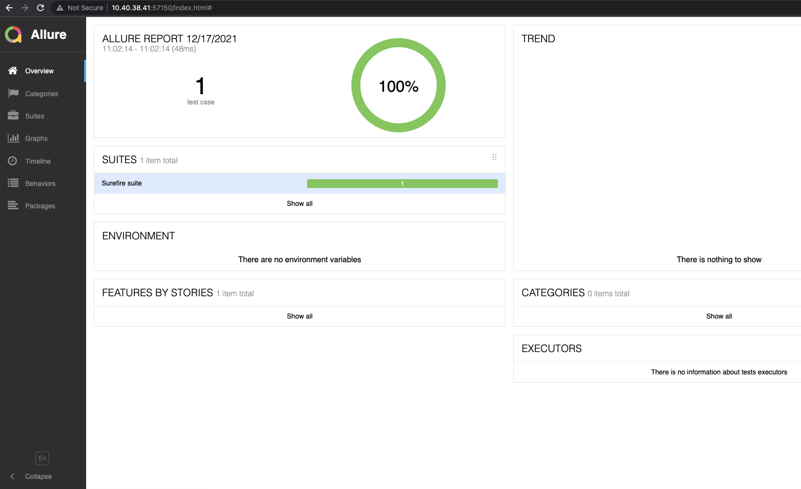

### Automated test project


This project is used to test automatically your web application.

It integrates:
- Cucumber: Test Driven Development framework [https://cucumber.io/](https://cucumber.io/)
- TestNG: Unit test framework [https://testng.org/doc/](https://testng.org/doc/)
- Selenium: Test automation framework for web application [https://www.selenium.dev/](https://www.selenium.dev/)
- Allure: Multi-language test report tool. [https://docs.qameta.io/allure/](https://docs.qameta.io/allure/)

### Building
```
mvn clean install
```

### Running the test
```
mvn test
```

### Reporting
You will need to install allure framework on your system to be able to visualize the test result.

On MacOS, you can use this command to install allure. 

Please, read the documentation to check how to install Allure on different operating system.

```
brew install allure
```


After the test run, the test result should be available in the  __allure-results__  folder.

Start the allure local server to display the result.

```
allure serve ./allure-result
```

This command should open your browser.




